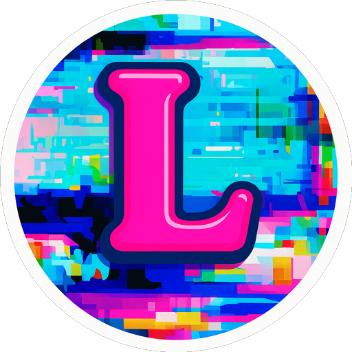

# Lombok

**A storage and compute platform for the people**

[Website](https://lombokapp.com) • [Documentation](https://lombokapp.com/docs) • [Github](https://github.com/lombokapp/lombok-web) • [Discord](https://discord.gg/ZSEKFG9gwd) • [Demo](https://demo.lombokapp.com)

## 🚀 What is Lombok?

Lombok is a **free, open-source, and self-hostable** storage and compute platform designed for individual consumers and small enterprises who want a powerful alternative to commercial options without to spending days learning a complex architecture or investing in powerful hardware. Lombok runs on any S3-compatible storage service and can be deployed quickly and easily on minimal hardware.

### ✨ Key Features

- **🏠 Self-Hosted**: Deploy on your own hardware or cloud infrastructure
- **☁️ S3-Compatible**: Use any combination of S3-compatible storage backends at the same time (AWS S3, Cloudflare R2, SeaweedFS, Garage, MinIO, etc.)
- **⚡ Custom Apps**: Run custom apps on your data, with worker scripts and embedded UIs
- **🏗️ Simple Architecture**: Doesn't require deep expertise to run or extend the system
- **📦 Docker Ready**: Easy deployment with Docker containers (as little as a single Docker run command)
- **🔧 Developer-Friendly**: Built with modern TypeScript and Bun

### 🏗️ App Platform Architecture

#### Lombok makes it easy to build arbitrarily complex apps that integrate deeply with the main application

- **⚙️ Worker API**: Build Typescript apps that are executed as background workers or API request handlers
- **🌐 Web UI**: Create frontends in whatever framework you like (or none), and have them served as part of the main application
- **🎨 UI Library**: Use our React + Tailwind design library to achieve a consistent look, quickly
- **⚡ Event Based**: Hook into system events to trigger app functionality

### Coming Soon Features

- **📱Native iOS mobile apps**: Sync files and photos from your device, directly to your own private storage
- **🔒 E2E Encryption**: Encrypt everything before it leaves your device for ultimate peace of mind
- **💾 Automatic Backups**: Enable full 3-2-1 backups for your most important data with a couple of clicks

---

**Ready to get started?** Visit our [Getting Started](https://www.lombokapp.com/docs/run-lombok/standalone) docs or jump straight into [development](DEVELOPMENT.md)!
